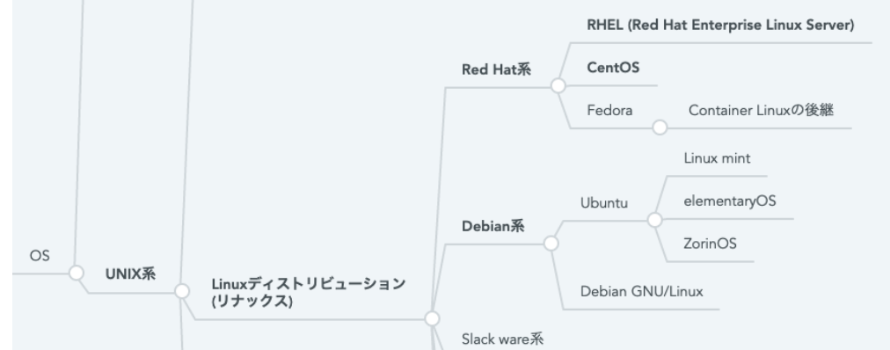
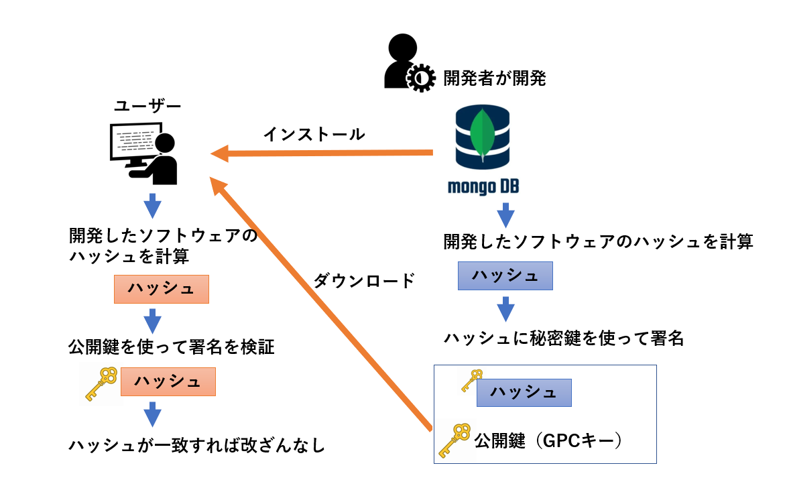

# mongoDB

## 目次

- [学習内容](#学習内容)
- [mongodbとは](#mongodbとは)
- [RHELとは](#rhelとは)
- [osの違いについて](#osの違いについて)
- [mongoDBのインストール(ローカル環境)](#mongodbのインストールローカル環境)
- [mongoDBのインストール(ローカル環境、手動ダウンロード・インストール)](#mongodbのインストールローカル環境手動ダウンロードインストール)
- [mongoDBのインストール(EC2のRHELで試してみる)](#mongodbのインストールec2のrhelで試してみる)
- [mongoDB(v5.0)のインストール(EC2 Ubuntu 24.04 LTS) ★成功](#mongodbv50のインストールec2-ubuntu-2404-lts)
- [mongoDBの練習（別ページ）](./prc_mongoDB.md)

## 学習内容

環境：AWSのEC2  
OS：RHELv7.9  
ミドルウェア：mongoDB  

最終的には、EC2インスタンスのmongoDBのバージョンをv4.4→v5.0へ上げる方法を知る  


## mongoDBとは

- NoSQLのDB
- データはドキュメントという単位で使用される  
- v4.4は2024年2月29日にサポートを終了している

## RHELとは

- Red Hat Enterprise Linuxの略  
- 有料のOS
- RedHat系のOSでは業界スタンダードなOSである
- EC2インスタンスで使用されるAmazon LinuxはRedHat系のOS



### OSの違いについて

1. パッケージ管理システムの違い
  Debian系：aptコマンド  
  RedHat系：yumコマンド  

2. ディレクトリ構造
  システム起動時に実行されるスクリプトやデーモンの配置場所
  Debian系：/etc  
  RedHat系：/etc/rc.d/init.d, /etc/rc.d/rcX.d  

3. 開発とサポート  
  Debian系：Debianプロジェクトによって融資メンバーで開発。提供無料  
  RedHat系：Red Hat者によって開発。有償ライセンスにてサポートが行われている  

4. 派生ディストリビューション
  Debian系：Ubuntu、Linux Mint  
  RedHat系：CentOS、Fedora、Amazon Linux  

## mongoDBのインストール(ローカル環境)

ローカル環境のOSはUbuntu(Debian系)のため。パッケージ管理システムはaptを使用する。  

- MongoDBの公式GPGキーを追加します。
  ```
  wget -qO - https://www.mongodb.org/static/pgp/server-4.4.asc | sudo apt-key add -
  ```
  【コマンド解説】  
  wget：ウェブサーバーからコンテンツをダウンロードするためのフリーソフトウェアユーティリティ  
  (ユーティリティ：grepやlsなどのOSにあるパッケージのこと)  
  -p：wgetが出力する全ての非メッセージエラーの制御  
  -O：ダウンロードした内容を標準出力に書き出す  
  apt-key add - ：aptパッケージ管理システムの信頼できるキーリストにキーを追加。「-」はキーが標準入力から読み取られることを指す  

- リポジトリのリストファイルを作成  
  ```
  echo "deb [ arch=amd64,arm64 ] https://repo.mongodb.org/apt/ubuntu focal/mongodb-org/4.4 multiverse" | sudo tee /etc/apt/sources.list.d/mongodb-org-4.4.list
  ```
  【コマンド解説】  
  やろうとしていること：MongoDBのリポジトリをシステムのAPTソースリストに追加→mongoDBをapt installできるようにする  
  deb：このエントリがバイナリリポジトリを指していることを示している  
  [ arch=amd64,arm64 ]：このリポジトリがamd64,arm64アーキテクチャのパッケージを提供していることを示す  
  focal/mongodb-org/4.4：リポジトリ内の特定のセクションを示す。  

- リポジトリの更新
  ```
  sudo apt-get update
  sudo apt-get upgrade ←installでエラーになったので追加したけど、解決しなかった。
  ```
  【コマンド解説】  
  これには3つの意味がある。  
  1. 新しいパッケージの取得
  2. セキュリティアップデート
  3. 依存関係の解決

- MongoDBのインストール
  ```
  sudo apt-get install -y mongodb-org
  ```
libssl-devというパッケージに問題があり、installはエラーで解決できなかった。  

- ~~サービス開始~~
  ```
  sudo systemctl start mongod
  ```

## mongoDBのインストール(ローカル環境、手動ダウンロード・インストール)

- MongoDBの公式サイトからMongoDBのバージョンv4.4のtgzファイルをダウンロード
  ```
  wget https://fastdl.mongodb.org/linux/mongodb-linux-x86_64-ubuntu1804-4.4.10.tgz
  ```

- ダウンロードしたファイルを解凍
  ```
  tar -zxvf mongodb-linux-x86_64-ubuntu1804-4.4.10.tgz
  ```

- 解凍したディレクトリを/usr/local/mongodbに移動
  ```
  sudo mv mongodb-linux-x86_64-ubuntu1804-4.4.10/ /usr/local/mongodb
  ```

- 環境変数にMongoDBのパスを追加
  ```
  echo 'export PATH=/usr/local/mongodb/bin:$PATH' >> ~/.bashrc
  source ~/.bashrc
  ```

- MongoDBのデータディレクトリを作成
  ```
  sudo mkdir -p /data/db
  ```

- MongoDBを起動
  ```
  mongod
  ```

- 起動したら、以下のエラーが出た
  ```
  mongod: error while loading shared libraries: libcrypto.so.1.1: cannot open shared object file: No such file or directory
  ```

#### インストールできなかった
Ubuntu 22.04 LSTではv4.4が動作しないことが[報告されているらしい](https://www.mongodb.com/docs/v4.4/installation/)  
その可能性も考慮し、ここではここまでとする。
```
$ lsb_release -a
No LSB modules are available.
Distributor ID: Ubuntu
Description:    Ubuntu 22.04.4 LTS
Release:        22.04
Codename:       jammy
```


## mongoDBのインストール(EC2のRHELで試してみる)

RedHatOSを用意して、mongoDBをインストール  

```bash
cat /etc/redhat-release
Red Hat Enterprise Linux release 9.4 (Plow)
```
→RedHadの9.4を使用

- MongoDBの公式GPGキーを追加します。
  ```
  sudo rpm --import https://www.mongodb.org/static/pgp/server-4.4.asc
  ```
  【コマンド解説】  
  rpm：「Red Hat Package Manager」の略。ソフトウェアパッケージを管理するツール  
  -- import：指定したファイルをインポートする。という意味  

  GPG(GNU Private Guard Key)  
  公開鍵暗号方式を利用したデータの暗号化とデジタル署名の生成・検証に使用されるツール  
  

- 上記のキーは使用しないで、repositiryからインストール
  nanoが入っていないのでインストール  
  ```
  sudo yum update
  sudo yum install -y nano
  ```
  リポジトリの作成  
  ```
  sudo nano /etc/yum.repos.d/mongodb-org-4.4.repo
  ```
  リポジトリの内容  
  ```
  [mongodb-org-4.4]
  name=MongoDB Repository
  baseurl=https://repo.mongodb.org/yum/redhat/$releasever/mongodb-org/4.4/x86_64/
  gpgcheck=1
  enabled=1
  gpgkey=https://www.mongodb.org/static/pgp/server-4.4.asc
  ```
  mongoDBのインストール  
  ```
  sudo yum install -y mongodb-org
  ```
  やはり以下のエラーがでる。。。  
  ```
  Error: Unable to find a match: mongodb-org
  ```

## mongoDB(v5.0)のインストール(EC2 Ubuntu 24.04 LTS)

  結局以下の流れでインストールできた。  
  ```shell
  wget -qO - https://www.mongodb.org/static/pgp/server-5.0.asc | sudo apt-key add -
  echo "deb [ arch=amd64,arm64 ] https://repo.mongodb.org/apt/ubuntu focal/mongodb-org/5.0 multiverse" | sudo tee /etc/apt/sources.list.d/mongodb-org-5.0.list
  sudo apt-get update
  sudo apt-get install -y mongodb-org
  ```
  installコマンドで以下のエラーがでる。  
  ```
  The following packages have unmet dependencies:
  mongodb-org-mongos : Depends: libssl1.1 (>= 1.1.1) but it is not installable
  mongodb-org-server : Depends: libssl1.1 (>= 1.1.1) but it is not installable
  mongodb-org-shell : Depends: libssl1.1 (>= 1.1.1) but it is not installable
  E: Unable to correct problems, you have held broken packages.
  ```
  そのため、libssl1.1を別途インストール  
  ```shell
  echo "deb http://security.ubuntu.com/ubuntu focal-security main" | sudo tee /etc/apt/sources.list.d/focal-security.list
  sudo apt-get update
  sudo apt-get install libssl1.1
  sudo apt-get install -y mongodb-org
  sudo rm /etc/apt/sources.list.d/focal-security.list
  ```
  これでmongoDBのインストールが完了  
  mongoDBの操作等については[こちら](prc_mongoDB.md)で行う  
